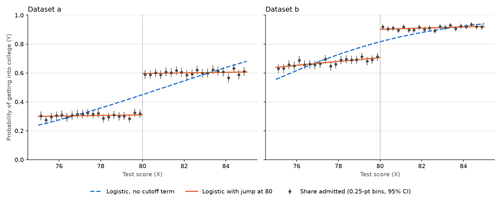

# Week 4 Reflection

## 1. The Coding Quiz gives two options for instrumental variables. For the second item (dividing the range of W into multiple ranges), explain how you did it, show your code, and discuss any issues you encountered.

I broke the data into 20 groups based on W. That way, everyone in a group has about the same W. Then within each group, I found out how much Y changed when Z went from zero to one, and then divided it by how much X changed. After that, I took the average across 20 groups. I got 1.51, which is about the same as 1.56 from the first option. This means that controlling for W didn't change the answer. Therefore, we don't need W because Z was already random for everyone.

```python
def iv_effect(df):
    means = df.groupby("Z")[["X", "Y"]].mean()
    change = means.loc[1] - means.loc[0]
    return change["Y"] / change["X"]

w_groups = pd.qcut(df["W"], 20)
print(np.mean([iv_effect(group) for _, group in df.groupby(w_groups, observed=True)]))  # 1.51
```

The issue I ran into when I first split W into groups is that the groups at the edge of the ranges only had a few people in them. This is because the extreme W values are rare. I fix this by using pd.qcut, which puts the same number of people into every group instead of breaking up the groups by range.

## 2. Plot the college outcome (Y) vs. the test score (X) in a small range of test scores around 80. On the plot, compare it with the Y probability predicted by logistic regression.



The gray dots on the graphs are the actual data. Since Y is only ever 0 or 1, I grouped students with similar scores and then plotted the percent of each group that got into college.

The blue line is the logistic regression's prediction. Since it can only draw a smooth curve, it doesn't account for the jump at a test score of 80. In dataset A, the chance of getting in increases from ~30% to ~60% when you get a score of 80, but the logistic regression predicts 45%. Dataset B has the same exact problem. The real chance of getting in increases from ~70% to ~90%. But the logistic regression predicts about 80%.

This means that using plain logistic regression actually hides a jump, which is the most important part of this data.
