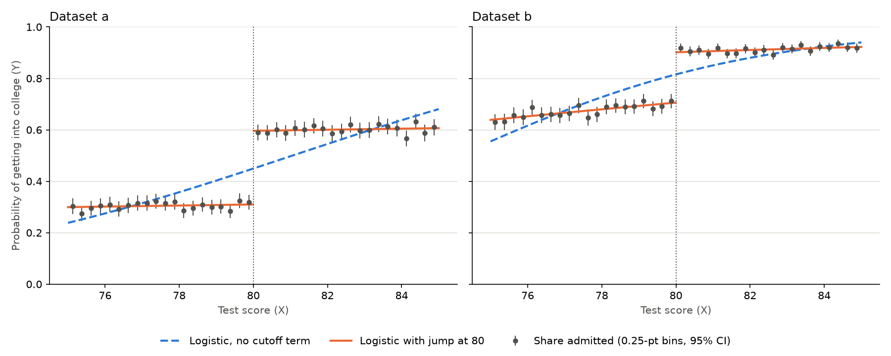

# Week 4 Reflection

## 1. The Coding Quiz gives two options for instrumental variables. For the second item (dividing the range of W into multiple ranges), explain how you did it, show your code, and discuss any issues you encountered.

I broke the data into 20 groups based on W. That way, everyone in a group has about the same W. Then within each group, I found out how much Y changed when Z went from zero to one, and then divided it by how much X changed. After that, I took the average across 20 groups. I got 1.51, which is about the same as 1.56 from the first option. This means that controlling for W didn't change the answer. Therefore, we don't need W because Z was already random for everyone.

```python
CSVS = Path(__file__).parent / "csvs"

def load(name):
    return pd.read_csv(CSVS / name)

def iv_effect(df):
    """(change in Y from Z=0 to Z=1) / (change in X from Z=0 to Z=1)."""
    means = df.groupby("Z")[["X", "Y"]].mean()
    change = means.loc[1] - means.loc[0]
    return change["Y"] / change["X"]

def effects_by_w(df, w_groups):
    """The effect within each W group. Groups with only one Z value are skipped."""
    return np.array([iv_effect(group) for _, group in df.groupby(w_groups, observed=True)
                     if group["Z"].nunique() == 2])

def report_instrument():
    df = load("homework_4.1.csv")
    print(f"effect ignoring W: {iv_effect(df):.2f}\n")

    # pd.cut: every group covers the same range of W. pd.qcut: every group has the same count.
    print(f"{'groups':<18} {'average':>8} {'lowest':>8} {'highest':>8}")
    for label, split, n in [("same range", pd.cut, 20), ("same range", pd.cut, 40),
                            ("same count", pd.qcut, 20), ("same count", pd.qcut, 100)]:
        effects = effects_by_w(df, split(df["W"], n))
        print(f"{f'{label} x{n}':<18} {effects.mean():8.2f} {effects.min():8.2f} {effects.max():8.2f}")
```

The issue I ran into when I first split W into groups is that the groups at the edge of the ranges only had a few people in them. This is because the extreme W values are rare. I fixed this by using pd.qcut, which puts the same number of people into every group instead of breaking up the groups by range.

## 2. Plot the college outcome (Y) vs. the test score (X) in a small range of test scores around 80. On the plot, compare it with the Y probability predicted by logistic regression.



```python
PLOT = Path(__file__).parent / "week4_reflection.png"
CUTOFF = 80
LOW, HIGH = CUTOFF - 5, CUTOFF + 5   # plot 75 to 85
DOT_WIDTH = 0.5                      # each dot covers half a point of score

INK, MUTED, GRID, BLUE = "#0b0b0b", "#52514e", "#e5e4df", "#2a78d6"

def near_cutoff(name):
    df = load(name)
    df.columns = ["X", "Y"]
    return df[df["X"].between(LOW, HIGH)]

def share_admitted(df, low, high):
    return df.loc[(df["X"] >= low) & (df["X"] < high), "Y"].mean()

def draw(ax, df, title):
    # Dots: share admitted in each half-point of score.
    edges = np.arange(LOW, HIGH + DOT_WIDTH, DOT_WIDTH)
    dots = df.groupby(pd.cut(df["X"], edges, right=False), observed=True)["Y"].mean()
    ax.scatter(edges[:-1] + DOT_WIDTH / 2, dots * 100, s=22, color=MUTED, label="Actual % admitted")

    # Line: probability predicted by logistic regression.
    fit = smf.logit("Y ~ X", df).fit(disp=0)
    scores = pd.DataFrame({"X": np.linspace(LOW, HIGH, 200)})
    ax.plot(scores["X"], fit.predict(scores) * 100, color=BLUE, lw=2.5,
            label="Logistic regression prediction")

    # Label: actual share within one point on each side of 80 vs. the prediction at 80.
    below = share_admitted(df, CUTOFF - 1, CUTOFF)
    above = share_admitted(df, CUTOFF, CUTOFF + 1)
    at_cutoff = fit.predict(pd.DataFrame({"X": [CUTOFF]})).iloc[0]
    label = (f"Actual: jumps {below:.0%} to {above:.0%} at {CUTOFF}\n"
             f"Logistic at {CUTOFF}: {at_cutoff:.0%}")
    ax.text(LOW + 0.2, 5, label, color=INK, fontsize=9)
    print(f"{title}: {label.replace(chr(10), '   ')}")

    ax.axvline(CUTOFF, color=MUTED, lw=1, ls=":")
    ax.set_title(title, color=INK, loc="left")
    ax.set_xlabel("Test score", color=MUTED)
    ax.set_ylim(0, 100)
    ax.yaxis.set_major_formatter(lambda v, _: f"{v:.0f}%")
    ax.grid(axis="y", color=GRID, lw=1)
    ax.spines[["top", "right"]].set_visible(False)

def report_plot():
    fig, axes = plt.subplots(1, 2, figsize=(11, 4.5), sharey=True)
    print()
    for ax, d in zip(axes, ["a", "b"]):
        draw(ax, near_cutoff(f"homework_4.2.{d}.csv"), f"Dataset {d}")

    axes[0].set_ylabel("Chance of getting into college", color=MUTED)
    fig.legend(*axes[0].get_legend_handles_labels(), loc="lower center", ncol=2, frameon=False)
    fig.tight_layout(rect=(0, 0.08, 1, 1))
    fig.savefig(PLOT, dpi=150)
    print(f"\nsaved {PLOT.name}")
```

The gray dots on the graphs are the actual data. Since Y is only ever 0 or 1, I grouped students with similar scores and then plotted the percent of each group that got into college.

The blue line is the logistic regression's prediction. Since it can only draw a smooth curve, it doesn't account for the jump at a test score of 80. In dataset A, the chance of getting in increases from ~30% to ~60% when you get a score of 80, but the logistic regression predicts 45%. Dataset B has the same exact problem. The real chance of getting in increases from ~70% to ~90%. But the logistic regression predicts about 80%.

This means that using plain logistic regression actually hides a jump, which is the most important part of this data.
